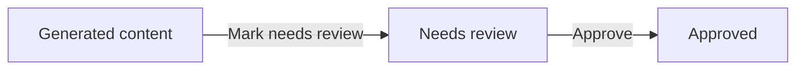
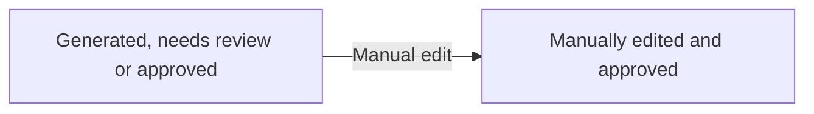
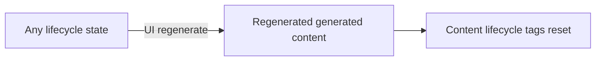
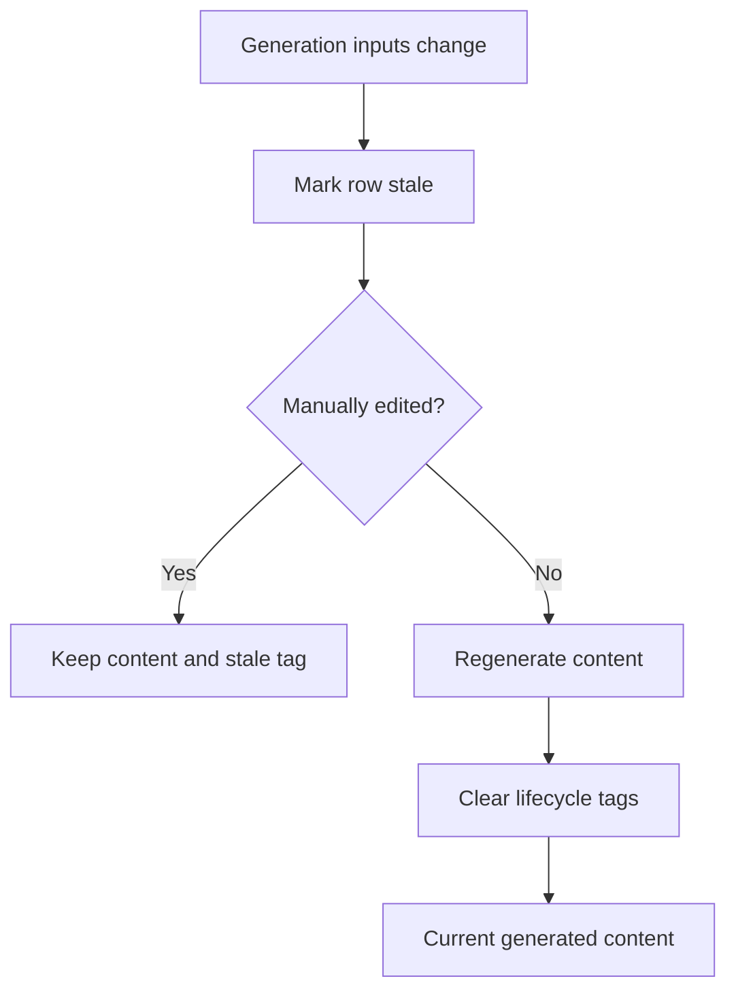
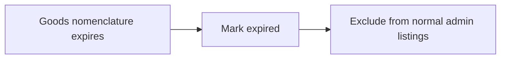

# Generated classification content lifecycle

This document describes how generated self-texts and labels are managed once they exist in the database.

## Purpose

Generated classification content exists to improve search and review for goods nomenclature records.

- **Self-texts** are self-contained descriptions of what a goods nomenclature covers. They are used to contextualise the commodity for search and downstream label generation.
- **Labels** are structured search labels for a goods nomenclature. They include simplified descriptions, known brands, colloquial terms and synonyms.

Both are generated by pipelines, stored in backend tables, and exposed through admin APIs so operators can review and correct them.

## Operating model

The common support workflow is:

1. A search issue arrives through support.
2. An operator identifies the goods nomenclature records involved in the result.
3. The operator reviews the self-text and label for those records.
4. If the generated content looks suspect but the fix needs investigation, the operator marks it as **needs review**.
5. If the operator knows the fix, they manually edit the content. A manual edit approves the row and protects it from normal pipeline overwrite.
6. If the operator wants to replace the current content with generated content, they use UI regeneration.

Approval means the current content has been reviewed for its current context. It is not the automation lock. Manual edit is the automation lock.

## Tags

| Tag | Meaning | Applied by | Cleared by | Operator action |
| --- | --- | --- | --- | --- |
| Needs review | The row is suspect and needs investigation. | Operator review action. | Approval, manual edit, pipeline generation, UI regeneration. | Investigate and either approve, manually edit, or regenerate. |
| Approved | The current content has been reviewed and accepted for the current context. | Operator approval or manual edit. | Marking needs review, pipeline generation, UI regeneration. | No immediate action unless the context changes or a new issue is found. |
| Manually edited | The current content was written or corrected by an operator. Normal pipeline regeneration must not overwrite it. | Manual edit. | UI regeneration when the operator deliberately replaces manual content with generated content. | Review stale manually edited rows manually before regenerating. |
| Stale | The stored context hash no longer matches the inputs that affect generation, or the row has been explicitly marked stale for regeneration. | Context hash checks or explicit stale marking. | Pipeline generation for non-manually-edited rows, UI regeneration for all rows. | If manually edited, decide whether to keep the manual content or regenerate. |
| Expired | The subject goods nomenclature is no longer current. | Expiry marking after tariff updates or reconciliation. | Not normally cleared. | No normal review action. Expired rows are excluded from normal admin listings by default. |

## Lifecycle transitions

### Review path

### Manual correction

### Regeneration

The diagrams are split so they are readable in GitHub and Confluence. The action table below describes the exact tags changed by each action. Score and rescore are not shown because they do not change lifecycle tags.

### Operator actions

| Action | Result |
| --- | --- |
| Mark needs review | Sets `needs_review`, clears `approved`. Does not change generated content. |
| Approve | Sets `approved`, clears `needs_review`. Does not change generated content. In admin this action is available once the row needs review. |
| Manual edit | Updates content, sets `manually_edited`, sets `approved`, clears `needs_review`. Normal pipeline regeneration must not overwrite the row. |
| UI regeneration | Replaces content with generated content even if it was manually edited. Clears `stale`, `needs_review`, `approved`, and `manually_edited`. It does not clear `expired`. |
| Score or rescore | Refreshes score fields. It does not change review, approval, stale, manual edit, or expiry tags. |

## Pipeline and context changes

Every row has a context hash derived from the inputs that affect generation.

When the current context hash differs from the stored hash, the row is stale.

Content-changing regeneration must refresh OpenSearch documents and composite search embeddings. Lifecycle-only changes do not refresh search side effects.

### Non-manually-edited rows

If a stale row has not been manually edited, the pipeline can regenerate it automatically. Pipeline regeneration clears:

- `stale`
- `needs_review`
- `approved`
- `manually_edited`

The row returns to generated content that has not yet been operator-approved.

### Manually edited rows

If a stale row has been manually edited, the pipeline leaves the content alone and keeps the stale tag.

That makes stale persistent for manually edited rows. A human needs to decide whether the manual content is still valid, edit it again, or use UI regeneration to replace it with generated content.

## Search side effects

There are two search paths affected by content changes:

- the goods nomenclature OpenSearch document
- the composite search embedding used for vector search

Content-changing actions must keep both paths in sync. Lifecycle-only actions do not need search updates.

| Action | Changes content? | Refresh OpenSearch document? | Refresh composite embedding? |
| --- | --- | --- | --- |
| Mark needs review | No | No | No |
| Approve | No | No | No |
| Manual edit self-text | Yes | Yes | Yes |
| Manual edit label | Yes | Yes | Yes |
| UI regenerate self-text | Yes | Yes | Yes |
| UI regenerate label | Yes | Yes | Yes |
| Pipeline regenerate self-text | Yes | Yes, through indexing flow | Yes, through scoring or embedding flow |
| Pipeline regenerate label | Yes | Yes, through indexing flow | Yes, through scoring or embedding flow |
| Score or rescore | Score fields only | No, unless score is included in the indexed document being refreshed by the caller | No content embedding change |
| Mark expired | Visibility metadata only | No content embedding change | No content embedding change |

## Expired goods nomenclature records

Expired commodities are excluded from trader search results. Generated content for expired records should also be excluded from normal generated-content admin listings so operators do not spend review time on content that cannot appear in search results.

The `expired` tag is visibility metadata. It does not delete generated content, it does not trigger regeneration, and it is not cleared by regeneration.

At the time of writing:

- self-texts and labels support an `expired` flag
- expired rows are excluded from normal admin listings when the flag is set
- no explicit admin UI filter for expired rows is required in this slice
