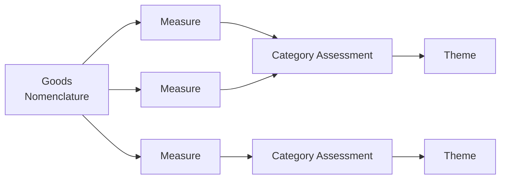

# Windsor Framework - Green Lanes

The green lanes support provides data allowing an API consumer to categorise Goods Nomenclatures according to the Windsor Framework agreement.

The categorisation determines whether a good can be moved between GB and NI under the Windsor Framework. There are three potential categorisations 1, 2 and Standard, with 1 being the most restrictive and Standard being the least.

**Note:** All green lanes specific code is namespaced under the `GreenLanes::` namespace

## Database

### Themes

We have a simple type table with each of the themes from Windsor Framework held in its own row.

This provides both the category and a description of the Theme.

### Category Assessments

The categorisation itself is derived from the measures applied to a Goods Nomenclature. To categorise we need to match particular measures with the relevant Windsor Framework Theme.

The `CategoryAssessment` join model matches particular measures on `measure_type_id`, `measure_generating_regulation_id` and `measure_generating_regulation_role`. The `CategoryAssessment` model the in turn points to the relevant `Theme` record which provides the category

This means there maybe multiple CategoryAssessments which apply to a particular GoodsNomenclature, and so multiple Themes with different Categories.

## API

The API we expose does not map directly to the internal normalised representation we have in the database. Themes are a one to one mapping but category assessments are more complicated.

### Goods Nomenclatures

Our primary API is a generic GoodsNomenclature API which accepts any 6, 8 or 10 digit GN Item ID and returns the request GN, together with lists for its ancestors, its descendants, the CAs which apply directly to the GN and the CAs which apply to the Descendants.

### Presented Category Assessments

The 0 or more Category Assessments are included in the GN API - these are _presented_ to include additional relevant information which the API consumer can use to determine whether a particular CA does in fact apply in the API consumers context.

Primarily this means a list of exemptions which the API consumer may determine are met and so be able to ignore a particular Category Assessment.

_The API consumer can determine the applicable CategoryAssessment by finding the most restrictive category assessment which does not have an applicable exemption._

_If the API consumer determines that no Category Assessments apply, then the Goods Nomenclature is determined to be **Standard Category**._

* To include the Exemptions list against the presented Category Assessment requires deriving the exemptions from the measures
* _BUT_ a particular Category Assessment may match multiple measures against the requested goods nomenclature
* _AND_ each of these measures may have a different set of exemptions

**This means that a single internal (ie DB) category assessment needs to be presented externally (ie API) as multiple category assessments, one for each permutation of exemptions.**

To achieve this the relevant measures are grouped together according to those with the same groups of exemptions (and geographical areas) and a separate CA is presented for each of these permutations.

## Pseudo Measures and Pseudo Exemptions

These are custom data points built by OTT to handle policies that don't explicitly appear in the EU tariff but are relevant under the Windsor Framework.

These pseudo measures allow us to assign some category assessments independently of the data the Tariff measures may contain.

### Pseudo Measures

These custom data points are designed to apply a Category Assessment directly to a Goods Nomenclature. These data points exist as a separate model (GreenLanes::Measure) and table that we control. Internally, this model is engineered to behave as similarly as possible to the tariff Measure model.

This means at a presenter level we can combine the pseudo measures with the regular measures. These Pseudo Measures apply to the whole world so apply to every permutation of the CategoryAssessment hence are not included in the calculation of the permutations of measures/exemptions.

On the API they look identical to serialized tariff Measures but use an id of `GL0000XXX`.

### Pseudo Exemptions

These are data points created by the OTT team and they applied directly to Category Assessments through their own join table.

They behave similarly to regular exemptions with `code` and `description` fields, and account for gaps between the WF and the EU tariff data. The model is `GreenLanes::Exemption`

On the API they are included in the regular exemptions list on a CA and are presented as their own entity type - `Exemption`.
